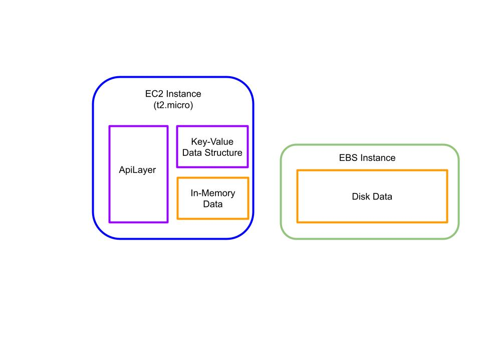

# brandywine-bridge
Custom distributed systems techniques implemented in C++.

This is intended to be run on an AWS EC2 instance with an EBS volume,
as shown below in the figure.

To create these resources using the AWS CLI, use the template "cf_brandywine.yaml"
and run the following command: 

'''
aws cloudformation create-stack --stack-name ec2-example --template-body file://cf_brandywine.yaml --capabilities CAPABILITY_IAM
'''